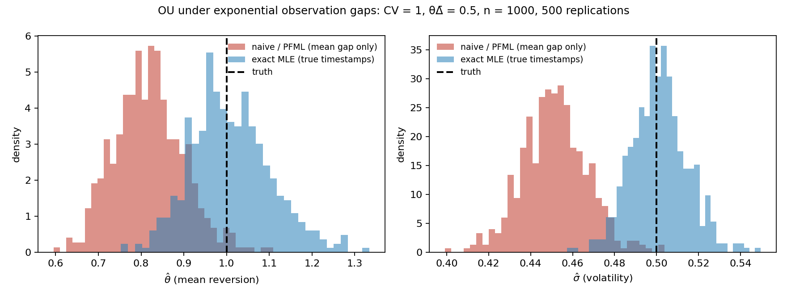

# Ornstein–Uhlenbeck estimation under irregular sampling

A computational study of how observation spacing affects exact maximum-likelihood,
mean-gap PFML, and Euler estimates of the Ornstein–Uhlenbeck model

$$
dX_t = \theta(\mu-X_t)\,dt + \sigma\,dW_t.
$$

**Current stage: Week 4 inference and preregistration.** Separate object-oriented
modules add observed-information Wald intervals and conditional bootstrap diagnostics
to the validated point estimators. The Week 3 APIs, schema and archives are preserved.
The project is proceeding independently; professor outreach remains deferred.
See the [Week 4 results and validation](docs/week4_progress.md),
[mathematical derivations](docs/week4_mathematics.md),
[modular architecture](docs/week4_architecture.md) and
[preregistered protocol](preregistration.md). Earlier work remains in the
[27 September validation update](docs/week3_validation_update.md),
[post-exploratory plan amendment](docs/plan_amendment_week3_validation.md),
[original Week 3 completion record](docs/week3_progress.md) and
[mathematical requirements and primary sources](docs/week3_mathematics.md).
The [Week 2 record](docs/week2_progress.md) and [OU derivations](docs/ou_derivations.md)
remain available. Written notes do not certify the owner's personal theory exercise.

The next research stages will measure finite-sample bias, RMSE and confidence-interval
coverage across a wider spacing grid, with equidistant comparisons. The current
notebook establishes point-estimation behavior at selected settings; it does not
establish coverage certification or an operating-region boundary. The mean-gap
estimator is the PFML estimator attributed to Aït-Sahalia & Mykland (2003), not a
new estimator introduced by this project. Week 4 evaluates the exact regular
checkpoint and two fixed-path bootstrap diagnostics; E1/E2 remain future work.

## Quick start: reproduce the Week 3 and Week 4 results locally

Install **Git and Python 3.12** first. Run all commands from the repository root.
No Jupyter server, GPU or external dataset is required; both runners generate
CSVs and PNG figures automatically.

### 1. Clone and install

```bash
git clone -c core.autocrlf=false https://github.com/skbdps/stochastic-processes.git
cd stochastic-processes
```

The clone option preserves the file bytes used by the archived source and protocol
checks, including on Windows.

**macOS / Linux (bash or zsh):**

```bash
python3.12 -m venv .venv
source .venv/bin/activate
python -m pip install -r requirements.txt
```

**Windows PowerShell:**

```powershell
py -3.12 -m venv .venv
.\.venv\Scripts\python.exe -m pip install -r requirements.txt
```

On Windows, use `.\.venv\Scripts\python.exe` in place of `python` in the commands
below. This uses the virtual environment without requiring PowerShell activation.
On macOS/Linux, keep the virtual environment activated.

### 2. Test and reproduce both experiments

```bash
python -m pytest -q
python -m ou_irregular.runner run --config configs/week3_smoke.yaml --output artifacts/local_week3
python -m ou_irregular.week4.runner run --config configs/week4_validation.yaml --output artifacts/local_week4
python scripts/validate_week4_artifacts.py --run-dir artifacts/local_week4 --output artifacts/local_week4_audit.json
```

The Week 3 command runs the **corrected validation experiment**, corresponding to
`artifacts/week3_validation_rerun/`. The earlier `artifacts/week3_smoke/` archive
records the original solver and is retained as historical evidence. The Week 4
command reproduces the registered checkpoint and bootstrap diagnostics; it does
not run the future E1/E2 research grids.

Use new output names, such as `artifacts/local_week4_2`, when repeating a run, and
update the audit command to use that directory. The runners protect nonempty
outputs. Local result directories are ignored by Git; the committed archives are
preserved. The audit report is deliberately outside the run directory so it does
not alter the set of files recorded in the run manifest.

### 3. Inspect the results

| Output | What to check |
| --- | --- |
| `artifacts/local_week3/replications.csv` | 540 fit rows: 9 cells × 20 datasets × 3 estimators |
| `artifacts/local_week3/summary.csv` | Bias, RMSE, Monte Carlo uncertainty and regular-design comparisons |
| `artifacts/local_week3/figures/` | Four plots of bias, RMSE, RMSE ratios and fit-failure rates |
| `artifacts/local_week4/coverage_summary.csv` | Exact-MLE checkpoint coverage for theta, mu and sigma over 2,000 datasets |
| `artifacts/local_week4/bootstrap_summary.csv` | Six selected-path checks; raw results are the 3,000 rows in `bootstrap_draws.csv` |
| `artifacts/local_week4/figures/` | Checkpoint coverage and bootstrap diagnostic plots |
| `artifacts/local_week4_audit.json` | Successful audit of the new run's provenance, seeded inputs, counts and summary arithmetic |

Both run directories also contain the resolved configuration and
`run_metadata.json`. The published checkpoint coverage is **94.45% (theta),
94.85% (mu), and 94.15% (sigma)**. The full recorded validation suite had 520
passing tests. These are reference results, not targets to tune a run toward.

The direct dependencies are pinned in `requirements.txt`. To reproduce the recorded
Linux environment more closely, use **Python 3.12.14** and install
`requirements-lock.txt` instead; that complete dependency list is specific to the
recorded Linux environment. Other platforms should start with `requirements.txt`.
Exact historical replay requires the recorded Python and scientific dependency
versions, and its test is skipped if those versions differ. Audit a new run using
the same environment that generated it. The audit verifies saved evidence; it does
not independently refit the models or recompute the Hessians. Floating-point
results, figure bytes and timing metadata can differ across machines.

The original master-plan PDF has been removed from the current checkout. The
[adopted amendment](docs/plan_amendment_week3_validation.md),
[preregistered protocol](preregistration.md) and progress reports document the
implemented methods and interpretation rules.

## Run Week 4 independently

After completing the quick-start installation:

```bash
python -m pytest -q
python -m ou_irregular.week4.runner run --config configs/week4_validation.yaml --output artifacts/my_week4_run
```

This runs 2,000 exact-MLE regular paths at q=0.5, n=1000, followed by 500
conditional bootstrap draws per estimator on each of two fixed paths (CV=0 and 2).
The published [validation artifacts](artifacts/week4_validation/) include raw
records, coverage counts, Monte Carlo uncertainty, interval endpoints, figures
and source/configuration provenance. Existing output directories are protected.
The protocol was [committed before execution](https://github.com/skbdps/stochastic-processes/commit/1b1255b0650ad7efcf700316bd1cccf704af4d2d).

`ou_irregular.inference` contains reusable services and small protocols for
estimators, likelihoods and simulators. Its concrete adapters call the unchanged
Week 3 APIs. `ou_irregular.week4` owns configuration, simulation experiments,
coverage accounting and reporting. Neither the inference core nor the Week 3
runner depends on Week 4 orchestration. Services can be replaced by composition;
custom scientific dependencies are labeled as unregistered diagnostics.

Natural-scale Wald intervals use the full observed Hessian and delta-method
covariance map. Their positive-parameter lower bounds are not clipped. Invalid
intervals remain in the operational coverage denominator. PFML/Euler covariance
is model-based; their plug-in bootstrap is diagnostic under misspecification.
Selected-path bootstrap checks do not establish bootstrap coverage.

Both figures can also be regenerated directly from saved summary tables:

```python
from pathlib import Path
import pandas as pd
from ou_irregular.week4.plots import DiagnosticFigureWriter

run = Path("artifacts/week4_validation")
DiagnosticFigureWriter().write(
    pd.read_csv(run / "coverage_summary.csv"),
    pd.read_csv(run / "bootstrap_summary.csv"),
    Path("artifacts/my_week4_figures"),
)
```

## Run the Week 3 harness

After completing the quick-start installation:

```bash
python -m ou_irregular.runner run --config configs/week3_smoke.yaml --output artifacts/my_week3_run
python -m ou_irregular.runner replot --run-dir artifacts/my_week3_run
```

The supplied smoke grid is 3 coarseness values × 3 CV values × 20 replications ×
3 estimators = **540 fits**. Its 250 observations per path have 249 gaps. Existing
outputs are protected; use a fresh directory or `--overwrite` for a known OU run.
The original [smoke artifacts](artifacts/week3_smoke/) are preserved. The separate
[validation rerun](artifacts/week3_validation_rerun/) uses exactly the same inputs,
with normalized profile/regression solvers, explicit fit validity, paired estimator
comparisons, and four figures including approximate Monte Carlo error bars.

The harness checks saved data against the planned design before replotting and
can replay one replication by its recorded cell ID. Replay checks source and
dependency provenance; deliberate changed-code replay requires a separate output
directory. Replotting historical outputs with changed code also requires a new
derived output directory. See the update report for commands. Its coverage fields are
explicitly uncomputed. Week 4 inference lives in its own runner and artifacts;
historical Week 3 rows are not retroactively changed. The tiny smoke sample cannot
establish a research threshold.

## Optional: reproduce the Week 2 notebook

After completing the quick-start installation, run:

```bash
python run_all.py
```

This rewrites the tracked Week 2 notebook, CSVs and teaser figure. It is separate
from the Week 3/4 quick start, which writes to fresh local output directories.

`run_all.py` runs pytest and executes every notebook code cell with the same Python
interpreter, regenerating the executed notebook, all four replication CSVs and the
teaser PNG. It uses an in-process IPython shell with captured text and image outputs;
no separate Jupyter server or local TCP connection is required. This runner targets
this notebook's synchronous Python cells. You can also open the notebook in a
notebook editor using a kernel from the same environment.

The seed is `20260902`, with independent child streams for each experiment. Every
reported fit must be finite and converged; a failed fit stops the run. Seeds and
version pins support reproducibility, but floating-point details and optimizer
statuses can still vary across platforms. Execution time excludes dependency
installation; recorded measurements are in the progress document.

## Contents

| Path | Purpose |
| --- | --- |
| `ou_irregular/inference/` | Data contracts, adapters, normalization, numerical Hessians, Wald and bootstrap services |
| `ou_irregular/week4/`, `configs/week4_validation.yaml` | Independent Week 4 orchestration, seed addressing, coverage accounting and figures |
| `preregistration.md`, `docs/week4_*.md` | Frozen design, mathematics, architecture, execution evidence and limitations |
| `tests/week4/`, `artifacts/week4_validation/`, `artifacts/week4_validation_evidence/` | Numerical/invariance/isolation tests, raw checkpoint and bootstrap evidence |
| `ou_irregular/config.py`, `configs/week3_smoke.yaml` | Validated, serialized experiment definition |
| `ou_irregular/spacing.py`, `ou_irregular/estimators.py` | Gap flooring and normalized exact-profile/PFML-OLS/Euler-WLS fitting with validity diagnostics |
| `ou_irregular/metrics.py`, `ou_irregular/plots.py`, `ou_irregular/runner.py` | Bias/RMSE and MCSE, nominal equidistant comparisons, run/replot/replay |
| `docs/week3_progress.md`, `docs/week3_mathematics.md` | Requirements, completed work, formulas, source checks and limitations |
| `docs/week3_validation_update.md`, `docs/plan_amendment_week3_validation.md` | Feedback decisions, numerical evidence, solver semantics and plan corrections |
| `artifacts/week3_validation_evidence/`, `scripts/validate_week3_update.py` | Input identities, before/after reconciliation, independent references and test evidence |
| `ou_irregular/ou.py` | Exact simulation; equidistant, exponential and Gamma gaps; exact/PFML/Euler likelihoods; multistart fitting; analytic checks |
| `notebooks/01_exact_mle_demo.ipynb` | Four Week 2 experiments and a clearly marked Euler preview, with executed outputs |
| `tests/test_ou.py` | Mathematical checks and optimizer regression tests |
| `results/*.csv` | One row per replication, including optimizer diagnostics |
| `figures/teaser.png` | Exact-versus-PFML demonstration |
| `docs/ou_derivations.md` | Wiener integral, OU solution, transition law, stationarity, likelihoods and optional exercises |
| `docs/week2_progress.md` | Current scope, validation evidence and next steps |
| `docs/prior_art_log.md`, `docs/related_work_notes.md` | Historical prior-art notes supplied with the project |

## Teaser: exact MLE versus PFML



Exponential observation gaps, CV = 1, mean gap = 0.5, 1000 observations and 500
replications; true theta = 1 and sigma = 0.5. PFML uses the realized average gap.
The exact estimator uses each timestamp and has small bias at this setting.

| Quantity | Exact MLE mean | PFML mean | PFML large-sample limit |
| --- | ---: | ---: | ---: |
| theta | 1.0095 | 0.8183 | 0.8109 |
| sigma | 0.5013 | 0.4515 | 0.4503 |

The exact-MLE relative biases are about +0.95% and +0.26%; PFML's are about
-18.17% and -9.71%, respectively. This result does not imply that exact MLE is
unaffected by irregular sampling: finite-sample bias and uncertainty may depend
on spacing. All table values regenerate from `results/cell4_teaser_naive_vs_exact.csv`.

## Next stage

Week 5 will implement E1 using the registered design and reusable inference
services, retaining both coverage denominators and uncertainty-aware practical
criteria. Week 4 does not run headline experiments or establish an operating boundary.

Author: Suryansh Kumar.
