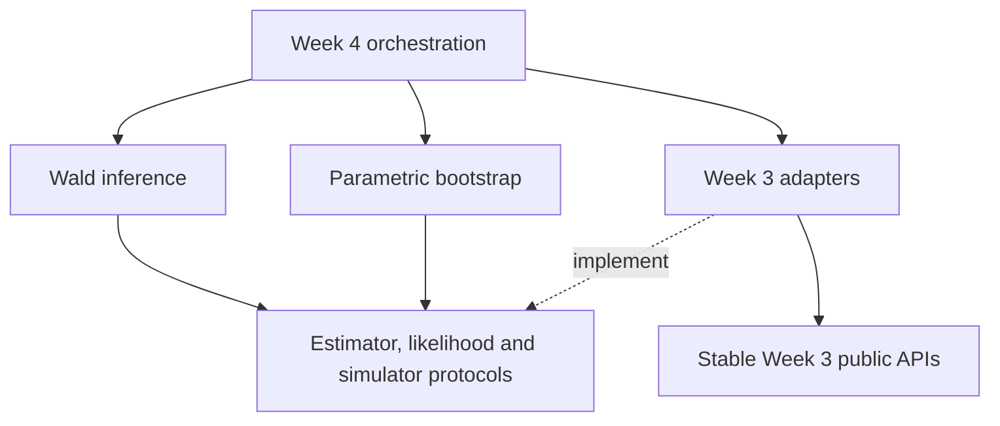

# Week 4 architecture: inference without changing Week 3

Week 4 adds an `ou_irregular.inference` package around the validated Week 3
public APIs. It uses composition, small Python protocols and explicit result
objects. Existing Week 3 callers retain their imports, point-fit semantics,
configuration and result formats. Historical Week 3 artifacts remain separate.

The important boundary is the direction of dependency: inference adapters may
call Week 3; Week 3 does not import inference. An uncertainty-method change does
not require changing the simulator, spacing generator or point-estimation
runner. The new execution layer composes the parts and owns its own run records.



Arrows represent software dependencies, not the order of statistical
calculations. Covariance coordinate maps and Hessian providers are internal
collaborators of the Wald service. The bootstrap needs an estimator and
simulator; it has no dependency on Wald inference or numerical Hessians.

## 1. Modules and responsibilities

| Module | Public objects | Responsibility |
| --- | --- | --- |
| `inference/contracts.py` | `Sample`, `PointFit`, `PointEstimator`, `ConditionalLikelihood`, `PathSimulator` | Validate observation arrays and define the small interfaces consumed by inference |
| `inference/adapters.py` | `Week3Estimator`, `OuLikelihood`, `ExactOuSimulator` | Translate existing Week 3 fit dictionaries and public functions into the inference contracts |
| `inference/coordinates.py` | `ObservationCoordinates` | Normalize observed state/time and map fitted parameters and covariance back to original units |
| `inference/hessian.py` | `HessianProvider`, `HessianEstimate`, `FiniteDifferenceHessian` | Differentiate an injected objective and report finite-difference stability |
| `inference/wald.py` | `WaldInference`, `WaldResult` | Compose point fit, coordinate map, derivative provider, numerical gates and natural-scale Wald endpoints |
| `inference/bootstrap.py` | `ParametricBootstrap`, `BootstrapResult` | Simulate and refit fixed scheduled bootstrap draws, retain failures and form percentile intervals |
| `week4/config.py` | `ValidationConfig` | Read the new strict validation YAML without broadening Week 3's smoke schema |
| `week4/simulation.py` | `OuSampleSource` | Reuse exact simulation and spacing primitives with the registered Week 4 stream addressing |
| `week4/runner.py` | `ValidationExperiment` | Inject source and inference factories, execute scheduled work and write separate provenance-aware run records |
| `week4/summaries.py` | `CoverageSummarizer`, `ThresholdPolicy` | Aggregate planned/valid counts, Monte Carlo uncertainty and prespecified classification |
| `week4/plots.py` | `DiagnosticFigureWriter` | Render validation output without changing Week 3 plotting conventions |

Paths in this table are relative to `ou_irregular/`. The mathematics and limits
of each procedure are in [week4_mathematics.md](week4_mathematics.md); the frozen
experiment choices are in [preregistration.md](../preregistration.md).

No inheritance hierarchy ties an estimator to a specific inference method.
Protocols describe the methods an object must provide; compatible classes need
not inherit a framework base class. Constructor injection makes collaborators
explicit and lets tests supply controlled likelihoods, estimators and
simulators. The concrete OU adapters are selected at the application boundary.
`ValidationExperiment` accepts a sample source, Wald factory and bootstrap
factory, so orchestration tests do not need to replace global functions or
depend on a particular optimizer. Its own configuration lives in
[`configs/week4_validation.yaml`](../configs/week4_validation.yaml). Scientific
configuration and deterministic cell/replication addressing are serialized
with the resulting run; a summary cannot silently redefine the original
number of planned trials.

## 2. Contracts and parameter conventions

`Sample(values, times)` copies matching finite one-dimensional arrays, requires
at least three observations and strictly increasing timestamps, and exposes
read-only arrays. Parameter vectors always use `(theta, mu, sigma)`; working
vectors use `(log(theta), mu, log(sigma))`. These conventions are not inferred
from column names or global state.

`PointFit` retains the numerical candidate, objective, estimator identity,
optimizer termination flag, statistical validity, status, reason and diagnostic
mapping. Optimizer success, point-fit validity and interval availability remain
different concepts. An inference result contains its original point fit so that
an unavailable interval never makes the candidate disappear.

The three integration ports are deliberately small:

```python
class PointEstimator(Protocol):
    name: str
    def fit(self, sample: Sample) -> PointFit: ...

class ConditionalLikelihood(Protocol):
    name: str
    def nll(self, working_parameters, sample: Sample) -> float: ...

class PathSimulator(Protocol):
    def simulate(self, parameters, times, rng, *, x0: float) -> Sample: ...
```

`HessianProvider.evaluate(objective, working_parameters)` adds a fourth
replaceable numerical boundary. Its `HessianEstimate` carries the matrix,
gradient, status, reason and diagnostics. The Wald service checks the returned
shape, symmetry, finite values, positive curvature, condition number and
standardized score even when an alternative provider is injected.

Simulation truth is absent from every core inference input. It belongs in
experiment configuration and evaluation, where coverage and error can be
computed after fitting. A method must not use known truth to choose numerical
scales, accept a candidate or set interval width.

## 3. Composing the services

Given existing `values` and `times` arrays, direct Python use is:

```python
from ou_irregular.inference.contracts import Sample
from ou_irregular.inference.adapters import (
    Week3Estimator, OuLikelihood, ExactOuSimulator,
)
from ou_irregular.inference.hessian import FiniteDifferenceHessian
from ou_irregular.inference.wald import WaldInference
from ou_irregular.inference.bootstrap import ParametricBootstrap

sample = Sample(values, times)
estimator = Week3Estimator("exact")
point = estimator.fit(sample)

wald = WaldInference(
    estimator=estimator,
    likelihood=OuLikelihood("exact"),
    hessian=FiniteDifferenceHessian(),
    level=0.95,
)
interval = wald.infer(sample, point_fit=point)

bootstrap = ParametricBootstrap(
    estimator=estimator,
    simulator=ExactOuSimulator(),
    draws=500,
    level=0.95,
    min_valid_fraction=0.95,
)
check = bootstrap.run(sample, point_fit=point, seed=20260928)
```

Passing the existing `PointFit` avoids fitting the original dataset twice.
Always inspect `interval.valid` or `check.valid`, plus the associated status and
reason, before using endpoints. Missing endpoints are represented as missing
values, not zero-width intervals. Bootstrap `standard_errors` can describe
valid-draw spread even when its interval-validity fraction was not reached;
use the result's validity and diagnostic fields when interpreting them.

For another existing estimator, change both `Week3Estimator("exact")` and
`OuLikelihood("exact")` to the same supported name (`"pfml"` or `"euler"`).
The Wald constructor rejects a name mismatch. The simulator remains exact OU
for all three estimators, preserving the data-generating model.

## 4. State, normalization and audit records

`ObservationCoordinates.from_sample` owns the numerical scaling: observed mean,
centered state RMS and realized mean gap. The coordinate object stores these
constants and the normalized sample. It supplies both parameter conversion and
the natural-parameter Jacobian, so the same maps determine estimates and
uncertainty. Derivatives hold these observed-data constants fixed.

The default Hessian provider evaluates central differences at full and half
steps. It records relative Frobenius discrepancy and the discrepancy whitened
by the fine-step Hessian. The Wald layer additionally records eigenvalues,
condition number, standardized score, normalization and interval convention.
It never borrows an optimizer's approximate inverse Hessian as observed Fisher
information or inserts a ridge merely to make an interval available.

Bootstrap results carry planned, attempted and valid counts plus per-draw
parameters, statuses, reasons and seed information. An invalid original fit is
a skipped check with no attempted draws. A failed simulated draw occupies its
scheduled slot; further draws are not added to replace it. The service checks
that an injected simulator preserves the exact timestamps and initial value.

Result objects use frozen data classes and read-only numeric result arrays to
discourage accidental alteration during aggregation. Application-level output
files record the actual configuration, source and environment provenance.
Object immutability is not a substitute for validating serialized run records
and planned denominators.

### Execution lifecycle and registration

The separate command-line entry point is:

```bash
python -m ou_irregular.week4.runner run \
  --config configs/week4_validation.yaml \
  --output artifacts/my_week4_validation
```

The output directory must be new or empty. The runner writes the resolved
configuration and an initial `running_incomplete` manifest before calculations.
It saves checkpoint rows every 250 paths and after the last path, then saves
bootstrap records after each complete source-cell/estimator check. This bounds
the amount of completed work lost on interruption without introducing retries
or changing scheduled seeds. It is not an automatic resume mechanism: an
interrupted method can contain attempted draws still held only in memory.

An interruption or unhandled execution error marks the manifest `incomplete`
and retains the saved batches. A finished run with unexpected source, inference
or bootstrap-draw dependency exceptions is marked
`implementation_review_required`; those exceptions are distinct from ordinary
invalid statistical fits. Status `completed` means execution finished without
such exceptions. It does not certify nominal coverage or settle scientific
interpretation.

Successful completion writes `certification.csv`, `coverage_summary.csv`,
`bootstrap_summary.csv`, `bootstrap_draws.csv`, `inference_failures.csv`,
`cells.json`, figures and `run_metadata.json`. The manifest includes source and
artifact hashes, dependency versions, interval/point status counts and the
registered-versus-diagnostic study role. Source-file hashes are checked again
at completion; a code change during execution prevents a completed provenance
claim.

The reference freeze is Git commit
`1b1255b0650ad7efcf700316bd1cccf704af4d2d`. Registration checks compare its fixed
configuration and preregistration digests with the actual files and resolved
settings. They do not bless a run merely because it matches an editable YAML
currently on disk. Custom scientific collaborators or changed settings mark a
run `diagnostic_unregistered`, making small tests and alternative services
useful without presenting them as the registered checkpoint. Figure generation
is a separate output dependency; replacing it does not change fitted intervals.

## 5. Extending the project safely

To add an alternative numerical Hessian, implement `HessianProvider`, return a
`HessianEstimate` and inject it into `WaldInference`. Validate it against known
derivatives and coordinate transformations. Its introduction into a scientific
run is a versioned method change if it alters the registered procedure.

To add an alternative OU estimator, implement `PointEstimator` and an associated
`ConditionalLikelihood` with the same name and coordinate convention. Retain
explicit boundary and optimizer status. The existing `Week3Estimator` adapter
does not need to know about this new class. If a new statistical model has
different state/time transformations, supply a separately designed inference
service rather than assuming the OU coordinate map remains valid.

To add profile, log-Wald, sandwich or another bootstrap interval, implement a
separate service or provider with an explicitly named result convention.
Do not overload `valid`, change old endpoints in place, or repurpose the current
model-based covariance label. Existing Wald and percentile results must remain
reproducible as their own methods.

Week 3 regression tests check its historical behavior. Inference tests target
independent derivative examples, covariance transformation, strict validity,
bootstrap conditioning and failure accounting; execution tests check complete
scheduled records and reproducibility. These layers serve different purposes:
a successful new checkpoint does not replace old regression tests, and passing
unit tests alone does not establish a finite-sample coverage claim.

The learning milestone and scientific milestone are separate as well. Written
theory notes support S4 study; they do not mark the owner's personal study
session complete. E1/E2 remain later experiments governed by the committed
preregistration and the checkpoint's documented disposition.
