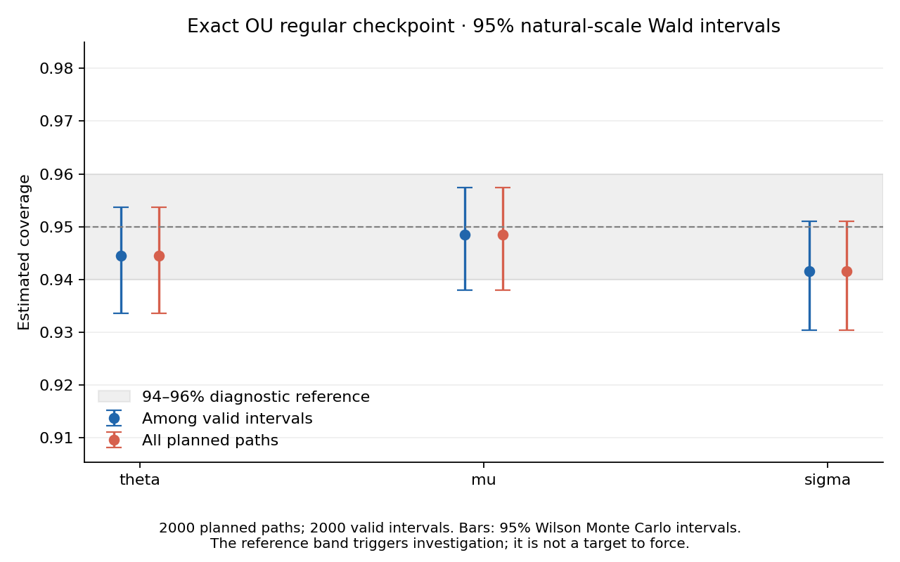
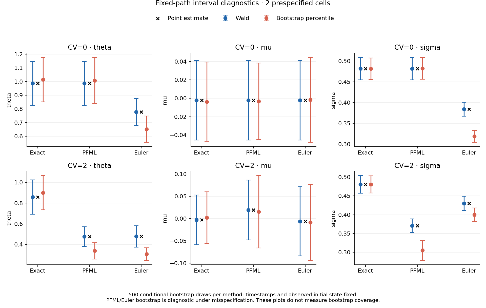

# Week 4: modular inference, validation and preregistration

Completed computational work on 27 September 2026. The fixed exact-OU checkpoint
meets the registered 94–96% diagnostic coverage reference for all three parameters.
The numerical validation, bootstrap diagnostics and preregistration are complete.
This is evidence at one regular design, not a general coverage guarantee or an
operating-region result. E1/E2 have not been run.

## Scope and separation from Week 3

| Planned mathematical/programming task | Delivered |
| --- | --- |
| Fisher information, Wald intervals, delta method and bootstrap theory | [Mathematical derivations and primary sources](week4_mathematics.md), with explanations beside the implementation |
| Full observed information | Independent central finite differences in normalized working coordinates; full/half-step and whitened-curvature checks |
| Wald intervals | Full covariance inversion, natural-parameter Jacobian, symmetric 95% endpoints and explicit invalid outcomes |
| Parametric bootstrap | Injectable simulator/refitter, fixed timestamps and initial value, independent streams, raw draws, percentile intervals and sample SD |
| Certification cell | Exact estimator; q=0.5, CV=0, n=1000; 2,000 registered source paths |
| Bootstrap spot checks | Two predetermined source paths, CV=0 and 2; all three estimators; 500 draws each |
| Frozen design | [Preregistration](../preregistration.md): E1/E2 grids, reps, seeds, floor epsilon, validity/threshold rules and no-peeking policy |
| Modular code | [Architecture](week4_architecture.md): small protocols, immutable result objects, injected services and concrete adapters |
| Reproducibility | Raw CSVs, recorded input hashes and seeds, source/configuration digests, figures, test log and artifact audit |

Week 4 lives in `ou_irregular/inference/` and `ou_irregular/week4/`. Only the
adapters and sample source reuse stable Week 3 fitting/simulation APIs. The
inference services receive observations, never simulation truth; experiment
evaluation owns truth and coverage counting. Week 3's top-level source files,
runner, configuration schema and historical artifacts remain byte-for-byte
unchanged. README additions link the separate workflows.

The plan's S4 **personal learning session** is not certified by producing code
or written notes. The owner can use the mathematics document for that session.
Tang–Chen full-text reading remains outstanding, and professor outreach remains
deferred. Neither activity is represented as completed here.

## Freeze and execution record

The [freeze commit `1b1255b`](https://github.com/skbdps/stochastic-processes/commit/1b1255b0650ad7efcf700316bd1cccf704af4d2d)
contains the protocol and `configs/week4_validation.yaml` before the canonical
checkpoint or bootstrap checks were run. This follows the disclosed
[Week 3 plan amendment](plan_amendment_week3_validation.md); the earlier smoke
results were exploratory and already known.

The canonical run started at **18:24:21 UTC**, completed at **18:24:37 UTC**,
and took **15.25 seconds** in the recorded environment. It used the frozen seeds
and settings once; there was no outcome-driven repeat, seed change, grid change,
failure replacement, confidence-interval substitution or clipping of bounds.
Earlier integration tests used explicitly unregistered tiny designs.

The [run manifest](../artifacts/week4_validation/run_metadata.json) records the
full freeze SHA, configuration/preregistration hashes, recursive package-source
hashes, dependency versions, input design, artifact hashes and completion status.
Its registered-configuration and registered-procedure checks both pass; no
scientific collaborator was overridden. Custom injected services or a different
configuration are labelled unregistered diagnostics.

## Exact regular checkpoint

Truth is theta=1, mu=0, sigma=0.5. Each path has 1,000 observations and 999
regular transitions. **All 2,000 point fits and all 2,000 intervals are valid.**
Operational coverage (all planned paths) therefore equals conditional coverage
(valid intervals only) in this run. Both denominators remain separate in the
implementation and saved tables.

| Parameter | Covered / planned | Coverage | Monte Carlo SE, percentage points | 95% Wilson Monte Carlo interval |
| --- | ---: | ---: | ---: | ---: |
| theta | 1889 / 2000 | 94.45% | 0.512 | 93.359–95.371% |
| mu | 1897 / 2000 | 94.85% | 0.494 | 93.793–95.736% |
| sigma | 1883 / 2000 | 94.15% | 0.525 | 93.034–95.096% |

All point estimates of coverage lie inside the registered diagnostic band, and
all three Wilson intervals contain 95%. These are Monte Carlo uncertainty
intervals for coverage, not parameter intervals for an individual path. The
theta relative bias is +1.085%; sigma relative bias is +0.133%. Relative bias is
not defined for mu=0; its absolute bias is about -0.000567.

| Numerical diagnostic | Maximum over 2,000 paths | Registered limit |
| --- | ---: | ---: |
| Relative full/half-step Hessian discrepancy | 3.889e-7 | 0.005 |
| Whitened Hessian discrepancy | 1.109e-6 | 0.01 |
| Normalized Hessian condition number | 16.713 | 1e10 |
| Standardized score / Newton decrement | 3.830e-6 | 0.01 |

Together with the independent analytic and invariance tests, these results
support the implemented procedure at the specified checkpoint. Passing the
coverage band alone would not demonstrate mathematical correctness. Under the
registered practical rule, theta and sigma are within the stated criteria at
this cell; that pointwise classification does not locate an operating boundary.



## Conditional bootstrap diagnostics

All **six checks have 500/500 valid bootstrap refits**: 3,000 planned and
attempted draws, with no replacements or dependency exceptions. Each cell uses
source replication 0; its observed timestamps and initial value stay fixed.
For each estimator, paths are simulated by exact OU at that estimator's fitted
parameters and then refitted by the same estimator. Seeds differ by estimator,
so even equivalent regular exact/PFML methods need not have identical empirical
bootstrap quantiles.

Theta results illustrate both agreement and the limitations of the procedure:

| CV | Estimator | Original estimate | 95% Wald interval | 95% bootstrap percentile interval |
| ---: | --- | ---: | --- | --- |
| 0 | Exact | 0.9866 | [0.8255, 1.1478] | [0.8531, 1.1766] |
| 0 | PFML | 0.9866 | [0.8255, 1.1478] | [0.8398, 1.1774] |
| 0 | Euler | 0.7788 | [0.6804, 0.8772] | [0.5563, 0.7492] |
| 2 | Exact | 0.8588 | [0.6927, 1.0250] | [0.7353, 1.0677] |
| 2 | PFML | 0.4767 | [0.3809, 0.5724] | [0.2581, 0.4186] |
| 2 | Euler | 0.4784 | [0.3744, 0.5823] | [0.2463, 0.3674] |

The PFML/Euler intervals do **not** uniformly agree with Wald intervals. In
particular, exact-OU resimulation at biased plug-in parameters followed by an
approximate refit can reproduce another shift away from the original estimate.
That is a limitation of this specified diagnostic; it is not a reason to change
the recorded draws to obtain agreement. Their inverse-Hessian covariance is
model-based rather than robust, and this bootstrap is not an automatic bias
correction. Two selected source paths do not estimate bootstrap coverage.
With 500 draws, each 2.5% tail contains only about 12.5 expected draws, so tail
endpoints also have appreciable Monte Carlo variability.

All parameter endpoints, sample SDs, statuses and raw draws are retained in
[bootstrap_summary.csv](../artifacts/week4_validation/bootstrap_summary.csv) and
[bootstrap_draws.csv](../artifacts/week4_validation/bootstrap_draws.csv).



## Tests and evidence

**520 tests passed in 10.12 seconds**, with no skips in the recorded environment:
the existing 300 tests and 220 Week 4 tests. The
[test log](../artifacts/week4_validation_evidence/pytest.txt) and
[execution log](../artifacts/week4_validation_evidence/execution.txt) are committed.

- An independent analytic regular-OU/AR(1) observed-information derivation checks
  the full numerical Hessian; an injected quadratic checks covariance mapping.
- Two designs, regular and CV=2, check covariance and interval transformations
  under changes of state and time units for all three estimators.
- Tests cover weak-curvature instability, nonpositive information, failed and
  boundary point fits, invalid endpoints, seed determinism, immutable results,
  fixed bootstrap conditioning, percentile/SD arithmetic and failure thresholds.
- Hand-counted examples distinguish conditional coverage from operational
  coverage, including all-invalid outcomes; threshold decisions retain Monte
  Carlo uncertainty and unresolved cases.
- End-to-end injected failures retain planned records and available point fits;
  dependency errors require review. Interrupted runs retain completed batches
  with an incomplete manifest and do not overwrite or silently resume archives.
- Week 3 isolation checks compare all eight original source files, eight original
  smoke outputs and eleven validation-rerun outputs with their historical hashes.
  Strict CV=2, q=0.5, replication-0 replay reproduces identical timestamps,
  observations, parameters and NLL for all three estimators without changing the archive.

The [artifact audit](../artifacts/week4_validation_evidence/audit.json) independently
checks saved digests, planned keys and counts, seeded source inputs, raw coverage
counts and bootstrap endpoint/SD calculations. Figures were visually inspected.

## Reproduce and continue

From the repository root in the pinned Python 3.12 environment:

```bash
python -m pytest -q
python -m ou_irregular.week4.runner run --config configs/week4_validation.yaml --output artifacts/my_week4_run --prereg-commit 1b1255b0650ad7efcf700316bd1cccf704af4d2d
python scripts/validate_week4_artifacts.py --run-dir artifacts/week4_validation --output artifacts/week4_validation_evidence/audit.json
```

The runner refuses nonempty output directories. Raw exports, derived summaries
and both figures are generated in one run; README shows separate figure
regeneration from the saved summaries. CSV missing interval values represent
unavailable intervals, not zeros. The manifest records Python 3.12.14,
NumPy 2.3.5, SciPy 1.17.0, pandas 2.2.3, Matplotlib 3.10.8 and PyYAML 6.0.3.
Exact floating-point reproduction can depend on the numerical environment.

There is no unresolved implementation defect identified by these checks that
blocks the registered E1 stage. Week 5 should compose the existing inference
services with its own orchestration, preserve the frozen choices and retain
all planned outcomes. It must still evaluate finite-sample behavior across
the grid; this checkpoint does not establish those results in advance.
